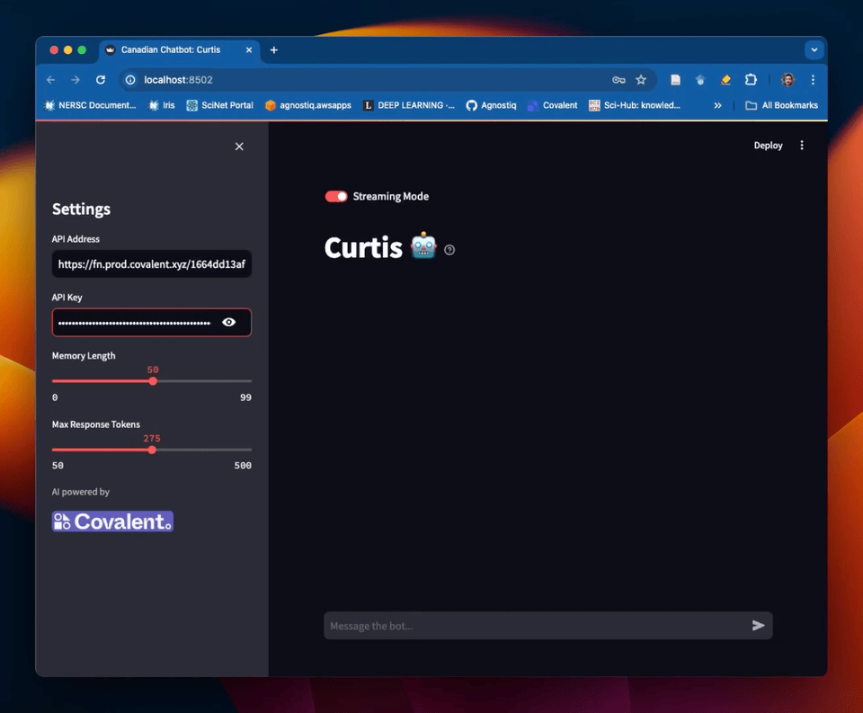

# Chatbot: Curtis Covalent

<div align="center">

</div>

## Instructions

To to try this out, you can run a local Streamlit application that communicates with the Covalent backend.

1. Make a conda environment with:
```
covalent-cloud>=0.65.1
streamlit==1.35.0
torch==2.2.2
transformers==4.39.3
```

2. Run the `chatbot-backend.ipynb` notebook to deploy the GPU Backend with Covalent.

3. Run the command `streamlit run chatbot-frontend.py` to start the local Streamlit app.

4. Copy-paste the deployment address and API key into the app's "Settings" sidebar.

That's all. You can now chat with Curtis Covalent!

## Details

This example is designed to run a Llama-based chatbot. There are two adjustable settings:

```python
MEMORY_LENGTH = 50
MAX_RESPONSE_TOKENS = 275
```
The memory length determines the number of prior messages (one prompt-response pair equals 2 messages) that the chat bot "remembers". The chatbot's memory lives in the Streamlit app cache, so refreshing the app window will clear the bot's memory. The maximum number of response tokens determines the length of the response.

### Prompting
The model is prompted as follows.
```python
LLAMA_PROMPT_TEMPLATE = """<s>[INST] <<SYS>>
You are a friendly Canadian chatbot named 'Curtis Covalent'. Introduce yourself as such.

Please consider the message history below, then provide a brief and polite response.
<</SYS>>
{message_memory} [/INST] """  # NOTE: trailing space is important!
```

The `message_memory` field is a formatted reproduction of the chat displayed to the user.

## Extras

The app will play a screen animation if the words "snow" or "balloons" are detected in the bot's response.
